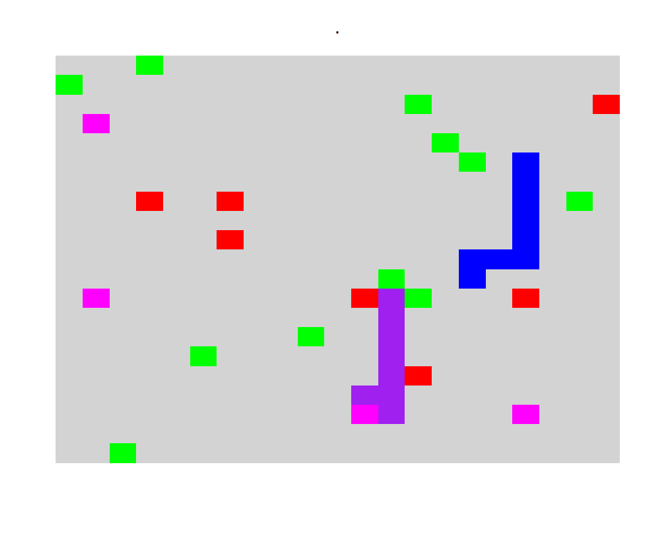
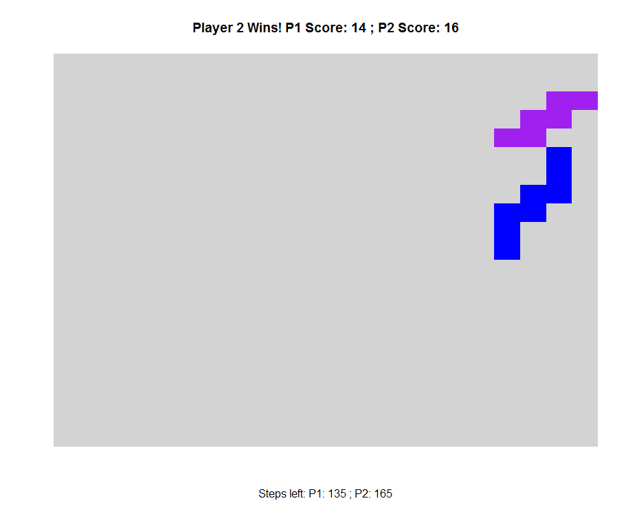
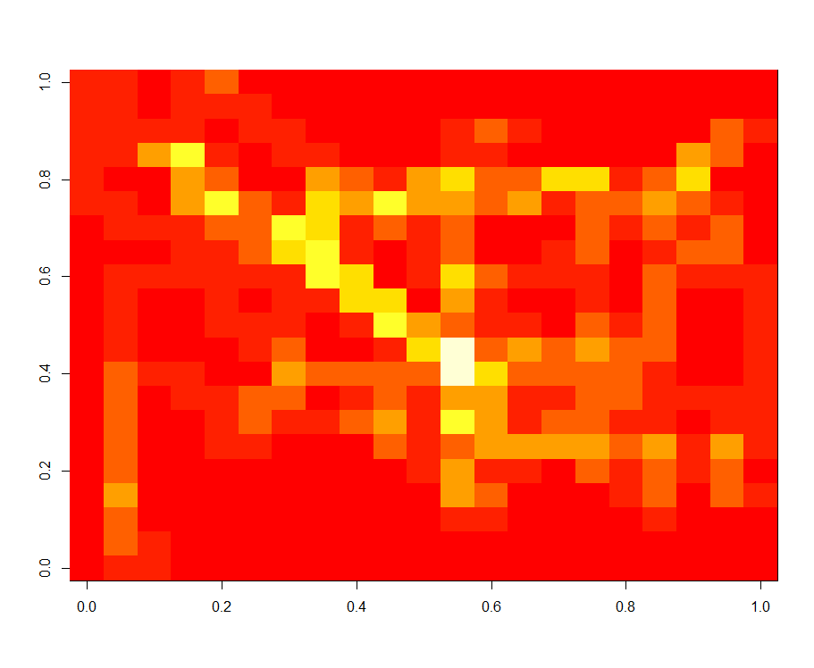
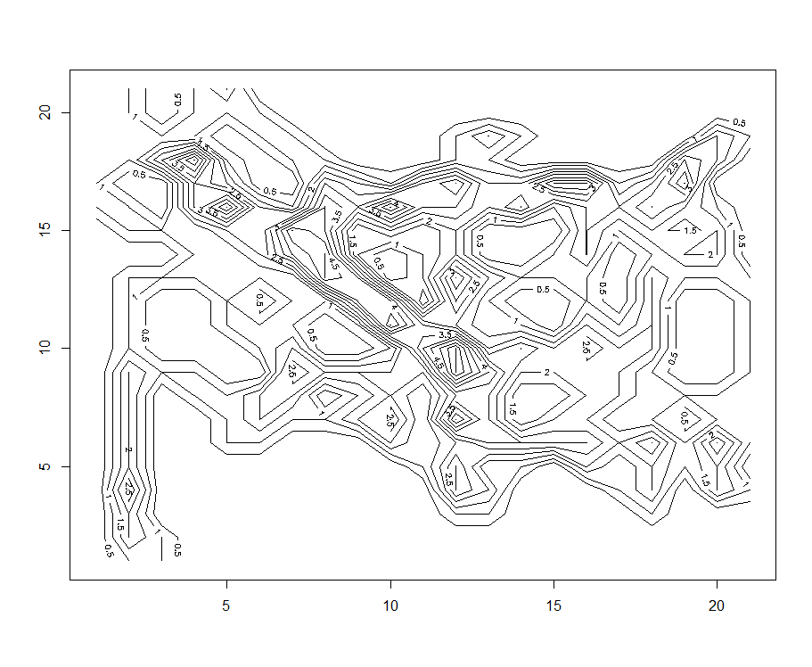
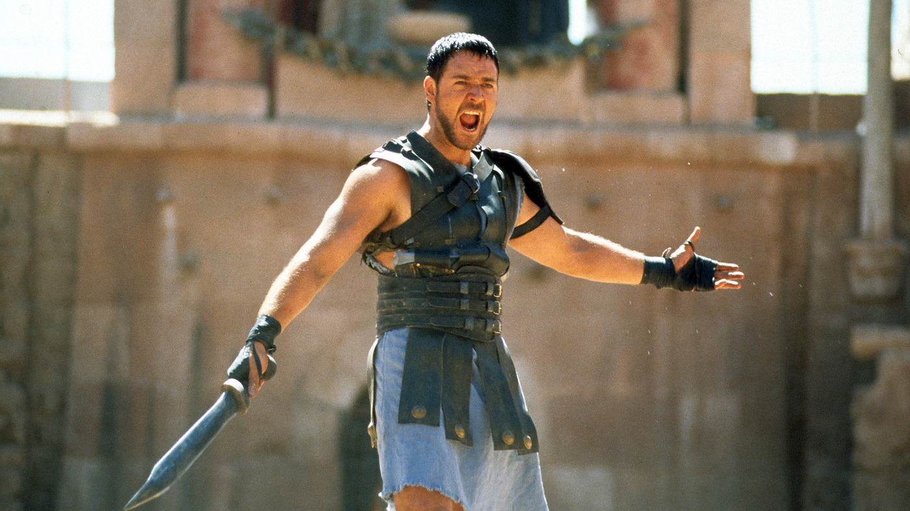
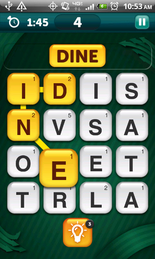
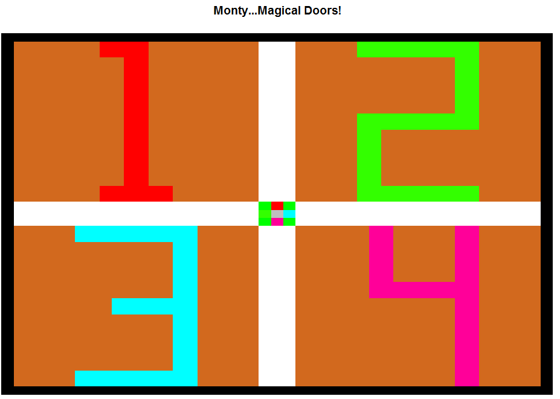
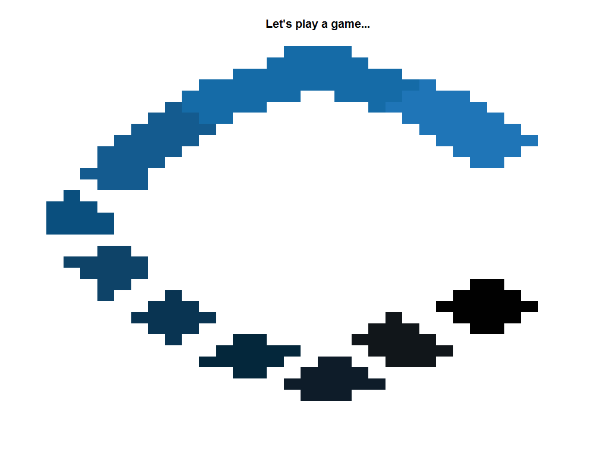

# These are games I made in R back in my college days.

## Conductor: 2 player snake game: 
Multiple arguments to determine if you want to speed up the game, have the snakes slither diagonally, grow their tails, how many energy points left, etc. 

 Starting positions

 End game and score tally

 Heat map of both the snake paths

Counter plot of both the snake paths
    
## Gladiator statistical game: Are you not entertained?!
Given 2 battling factions, each of them have an determined number of warriors. Each warrior has a certain Hit Points. Each battle consists of 1 vs 1 battle between a warrior of each faction. The probability of either warrior winning is the probability of his Hit Points over the sum of both warriors' Hit Points. The winning warrior returns to his faction unscathed and can be readily available for battle. The losing warrior is vanquished and destroyed. The end of the game is when only one faction remains and the other faction is obliterated. What is the optimal strategy if it is known each faction's warrior's Hit Points?  
Hint: Probability of faction winning can be modeled as exponential distribution.  

    
## Mafia: The popular party game also known as Werewolf: Make me an offer I can't refuse: 
Simulating multiple games of multiple to keep track of the running average of how many times the bad guys win depend on input parameters.  

    
## Scramble with Friends Solver: The popular mobile spelling game with friends:
Given the grid of the letters, determine the highest scoring words and the sequence of tile locations to spell them.

# Challenge Week: Built during my time at Captricity. Both have dedicated repos.  
<b>Capsino</b>: a speed typing game with an element of chance with a variant of the Monty Hall doors. Entire repo at https://github.com/eugeneh101/Capsino  

   
<b>Shreddr</b>b> a Fruit Ninja clone personally ported by me to R! We are slicing the Captricity logo. Actual hexadecimal colors of the logo included! Entire repo at https://github.com/eugeneh101/shreddr   
